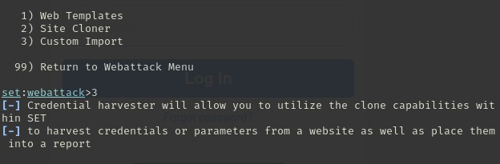

# Desafio-phishing-DIO
Criação de um phishing para capturar a senha do Facebook, clonando o site usando o setoolkit. Desafio proposto pelo bootcamp DIO.

# Ferramentas
- Kali
- Setoolkit

# Copiando o site em um arquivo local
Um dos obstáculos desse desafio é a criptografia que o site coloca sobre alguns tipos de ataqes simples, para burlar essa segurança basta copiar a pagina do site em um arquivo local. Então para realizar essa cópia devemos:

- Salvar a pagina desejada, trocar o nome do arquivo para ```index.htm``` e para que o site apresente a mesma aparencia do original é só copiar o código do site online na sua cópia index.


- Após isso devemos remover essa linha do código para seguir ao setoolkit


# Realizando o  ataque
- No Kali abra o terminal;
- Acesse o modo root com o comando ``` sudo su ```;
- Dentro do root insira o comando ``` setoolkit ``` para iniciar a ferramenta;


- Com a ferramenta aberta vai  ter o menu de ações, com os tipos de ataques da ferramenta e para esse ataque usaremos a opção 1 ``` Social-Engineering Attacks ```;


- Após escolher o tipo de ataque será exibido um menu com os vetores de ataque, agora selecionamos a opção 2 para vetor de ataque o ``` Web Site Attack Vectors ```;


- As próximas telas apresentam uma breve descrição das ações de cada ataque que faz parte do vetor de ataque e do método de ataque escolhidos, seguido pelo menu com esses tipos de ataques.
- No primeiro menu com os métodos de ataque selecionamos a opção 3 ``` Credential Harvester Attack Method ```;


- No segundo menu com os métodos de ataque selecionamos a opção 3 ``` Custom Import ```;



- Após concluir a última etapa aparecerá uma mensagem importante informando que é necessário utilizar um ip externo para que tenha a comunicação com o browser, então após informar o ip prossiga com enter;
- Em seguida será solicitado o caminho do site que desejamos clonar, então devemos copiar o caminho de onde está o arquivo que modificamos nas primeiras etapas, o  index.htm;
- Depois de colocar o caminho o arquivo  indicamos a opção 2 para copiar todo o arquivo  e logo em seguida será solicitada a url do site;


- Para testar o site falso basta pesquisar o ip que foi usado para hospedar o site falso e inserir os dados de login;


- E por fim para conferir os dados obtidos basta observar essa parte do resultado no terminal;


